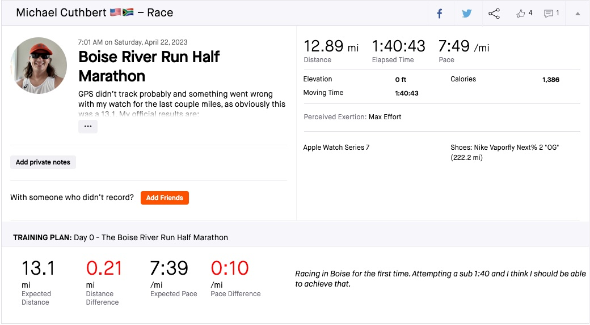
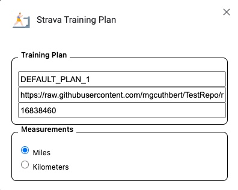
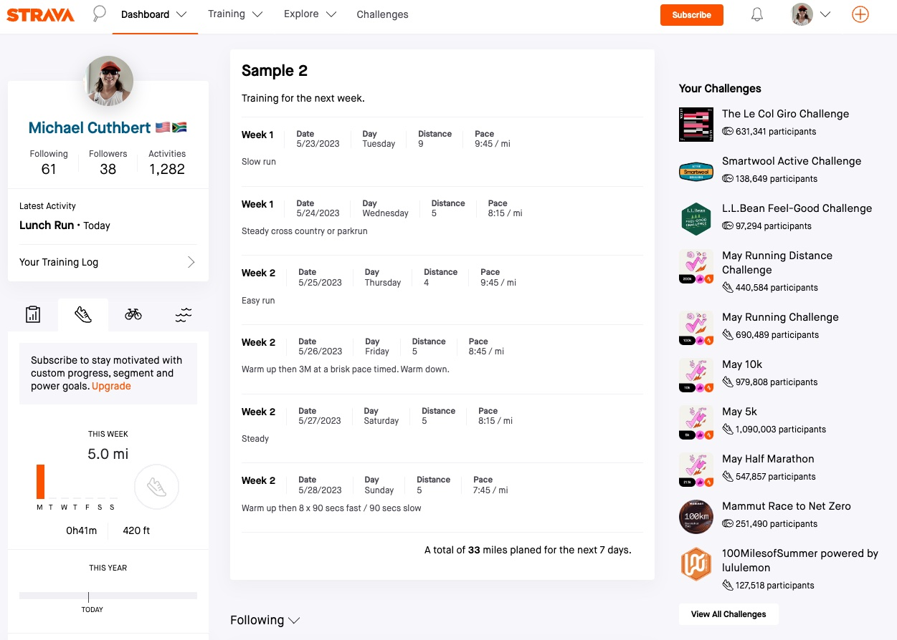

# TrainingPlan
A chrome Plugin that integrates a training plan into the Strava website. This training plan would primarily be for running as that is my primary sport. However could probably be used for sports that have similar kind of stats, like cycling. However because I do not really track these kinds of sports I am not certain at the usefulness of it.

## Current Features

### Activity Page


The activity page shows the basic information for the training matching the expected training for that day. It includes:
- A title that is supplied in the plan.
- A description of the plan display on the right next to the stats.
- The expected distance to be activity.
- The difference in distance compared to the actual activity. Will display in green if went equal to or further than the expected distance, red otherwise.
- The expected pace for the activity.
- The difference in pace compared to the actual activity. Like difference in distance, will display green if equal to or faster than the expected pace, red otherwise. This is simplistic and probably in the future I will allow a configurable buffer that will be in the green zone, or range for the plan, and if out of that range then it will be red. However simplistic for now.

### Options


The options page allows for some very basic options, however primarily used to point to the CSV file accessible online. I store the file on Github just because, but the file could technically be stored at any location that can be accessed from your browser. Here are the options:
- Plan Name - It is not super important what you put here, and if you don't put anything it will use a default plan name. This option is only useful if you have a caching issue and it is not picking up changes you made to your training plan.
- The URL location of the CSV training plan, I store my data in Github as it is just easier for me, but any accessible path for your browser would be allowed.
- AthleteId - This is your Strava AthleteId, the only thing this is used for is simply to only enable the training plan on your own activities and make sure it doesn't show up when you look at other peoples activities. Your AthleteId is never stored anywhere else or sent outside of your browser.
- Measurements - This allows you to select your preferred unit of measurement, either miles or kilometers. This will be removed eventually and will be pulled directly from the activity itself. It defaults to miles (I am American), so if you live just about anywhere else, you probably want to make sure to change this.

### Activity Feed Upcoming Training


The upcoming training in the activity includes training that is coming up in the next week, listing them with the following information:
- The day of the week the training will take place.
- The distance of the training.
- The expected pace for the training.
- The provided description of the training.

## Future Features
The future features will include the following:
- Integration in the My Activities page to include training data on all the activities listed.
- A calendar popout from the My Activities page to show your training plan fully.
- Multiple plans with date ranges, so that the plans are only active during those date ranges.
- Allow for multiple activities on a single day. Currently you can kind of do that as long as the activities are all of a different discipline. So you can run and then cycle on a single day as part of your plan, but you can't run twice.
- Integration into Premium Strava features like Training Log.

## Installation
In the future I will hope to make this process a lot easier than what it is, but for now if you wish to use it you will need to go through this process. The process is not detailed well enough at the moment, but here are a the basic steps.

### Download
1. Go to the 0.1.0 release in Github, which can be found here: [https://github.com/mgcuthbert/StravaTrainingPlan/releases/tag/0.1.0](https://github.com/mgcuthbert/StravaTrainingPlan/releases/tag/0.1.0). 
2. You can then download the packaged source code either in zip or tar.gz.
3. Once downloaded extract the code to some folder on your desktop.

### Build and Run
You will then need to build the code to build the package for Chrome. This will probably work for Firefox as well, but I haven't really tried. If you have downloaded the code from above, you can obviously skip the cloning step. Or if you want you can skip the download step and just clone. 
```js
 git clone https://github.com/mgcuthbert/StravaTrainingPlan.git
 cd StravaTrainingPlan
 npm install
 npm run build 
```
[load the build folder manually in chrome](https://github.com/mgcuthbert/StravaTrainingPlan)

### Chrome Installation
Once the package has been built, it would have created the package in the build directory. In Chrome perform the following steps:
1. Click on the three dots in the top right corner and select "More Tools" and then "Extensions".
2. This will open a webpage with the "Extensions" heading. In the top right corner of the page, turn on "Developer mode"
3. Click on "Load unpacked" and browse to the "build" directory where your newly built StravaTrainingPlan and click "Select".

Once you have preformed these steps you should have a new extension installed in Chrome.

### Setting up Options
Nothing will happen on Strava until you have setup your options for your training plan. You can do this by:
1. Click on "Details" under your newly installed extension.
2. On the next page, select the little icon to the right of "Extension Options"
3. This will open up a dialog box shown in the "Options" section above.
4. You can then configure the options as defined in the "Options" section.

### Creating Training Plan
Creating a training plan is fairly simple, and I have provided a very basic training plan for a single week that you can see [here](plans/sample.csv). Each entry for the training plan will be on a newline, and the csv will contain no headers and the following columns:
1. Date - A very specific date in the format YYYY-MM-DD. This will be used to match your entries in Strava.
2. Activity Type - This is the type of activity, you will see the type on your Strava activity page next to your name. Generally if you are running it will just be "run", but the type of run can also be "race", "Long Run" or "Workout". It is not case sensitive so you don't need to worry about that, whatever you put there needs to match the activity type text on the activity page.
3. Distance - This is the distance for the training. It doesn't really take into account any sort of unit of measurement. So whatever is defined in your options will define what say an entry of "5" means here. In the future will probably need to include unit of measurement so it can be converted as needed.
4. Pace - Again does not take into account any sort of unit of measurement, so this will need to be updated in the future. However currently, if you set your options to miles it will show "mi". Most of the time someone will not switch between mi and km, so this would not be an issue.
5. Title - This is just a nice title to give you training entry.
6. Description - A nice description to explain what you are doing on this training day. Nice if you plan to do intervals or something like that. 

**NOTE** Please note, do not include any comma's in your description or title as it will break the CSV. I am not parsing it smartly and you can't even escape them. So for now just don't use them.

Icons provided by <a href="https://www.flaticon.com/free-icons/cardio" title="cardio icons">Cardio icons created by ultimatearm - Flaticon</a>
